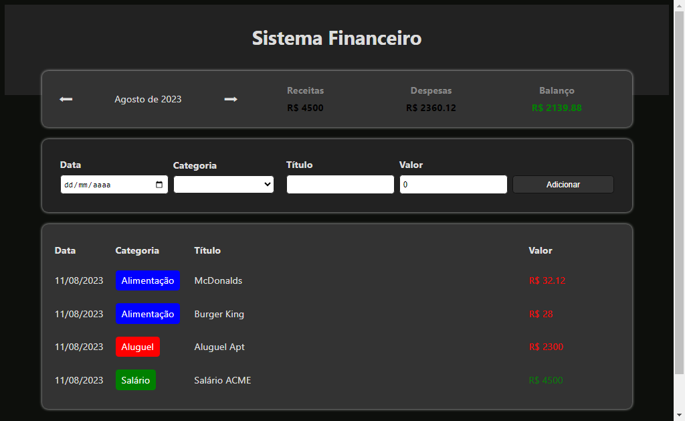

# Expense Tracker

> Sistema de Finanças Pessoais

Nesse projeto eu desenvolvi um Sistema de Finanças Pessoais com ReactJS + Typescript.

[Clique para acessar](https://guimiiller.github.io/expense-tracker/)

## 🚀 Tecnologias

- ReactJS
- Typescript
- Git e Github

## 💻 O que aprendi

- Aprendi como usar o styled-components
- Aprendi mais sobre Typescript
- Aprendi como passar informações entre componentes

## 📨 Contato

- guilhermemillerblack@gmail.com